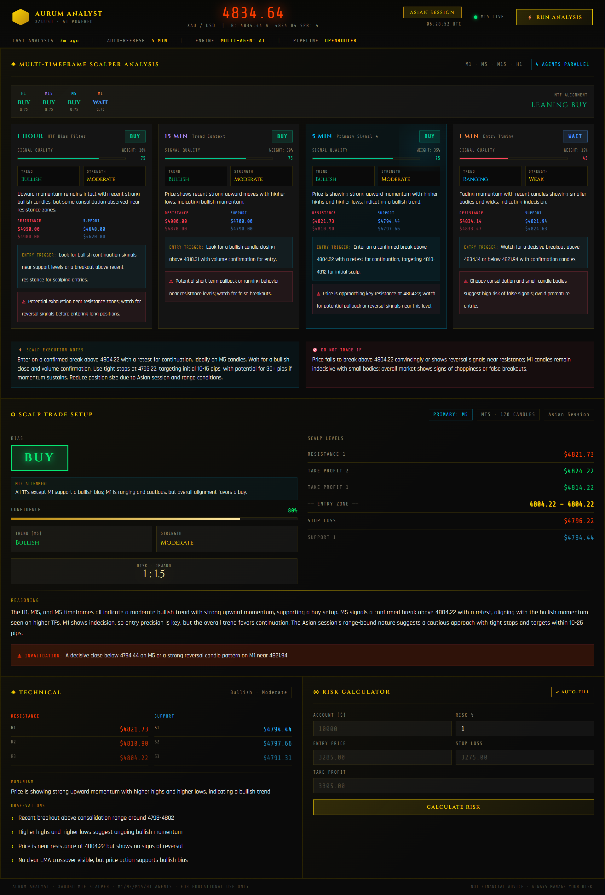

# XAUUSD AI Analyst

## Overview

XAUUSD AI Analyst is an intelligent trading companion designed to analyze the Gold (XAU/USD) market. By leveraging advanced Large Language Models (LLMs) via OpenRouter, the application automatically synthesizes market data, technical indicators, and fundamental news to generate actionable trade plans and insights.

The platform provides a streamlined user interface to view real-time analysis and AI-driven trading strategies tailored for the XAU/USD pair.
